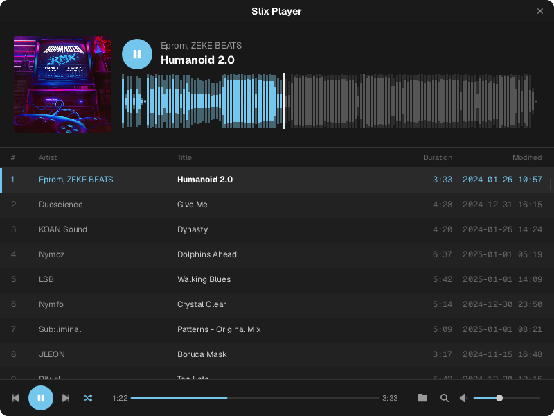

# Slix Player

A lightweight music player built with [Rust](https://www.rust-lang.org/) & [Slint](https://slint.dev/)



Currently only tested a little bit on Arch & OSX, but there are builds for windows to check out as well.

## Usage

Open it up and point to a folder with music files.  It'll recursively scan, analyse and add them.

## Features

Basically should be the same as any audio player you're used to, with play/pause etc..

But it does extract some info about the tracks & maintains your last playing state so you can resume where you left off.

* Analyses tracks and extracts metadata/cover art and builds a waveform.
* Cross platform UI with [Slint](https://slint.dev/)
* Track analysis with [`Symphonia`](https://github.com/pdeljanov/Symphonia)
* Track cache using [`fjall`](https://fjall-rs.github.io/)
* Playback using [`rodio`](https://github.com/RustAudio/rodio)
* Media Control Integration with [`souvlaki`](https://github.com/Sinono3/souvlaki)

*Note: This is a bit of an alpha project and there are probably bugs.  Feel free to raise an issue or a PR!*

## Downloads

You can download the latest release for your platform from the [releases page](https://github.com/cetra3/slix-player/releases).


## Compiling

You will need to ensure that you have the appropriate prereqs for slint

I.e,

```
sudo apt install -y build-essential libx11-xcb1 libx11-dev libxcb1-dev libxkbcommon0 libinput10 libinput-dev libgbm1 libgbm-dev
```

Then run:

```
cargo build --release
```

## Installing on Gnome

Make sure you can compile it, then run from this dir:

```
cargo install --path .
```

Make sure the cargo bin is on your path.

Then you can create a desktop entry by running:

```
./install_desktop_entry.sh
```
